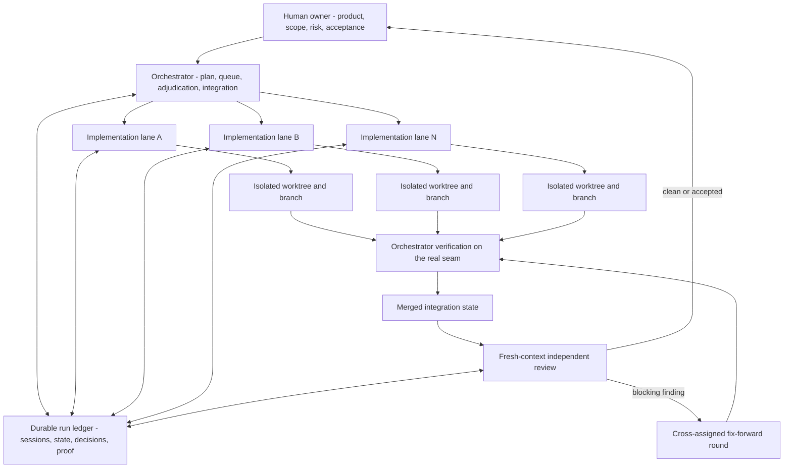
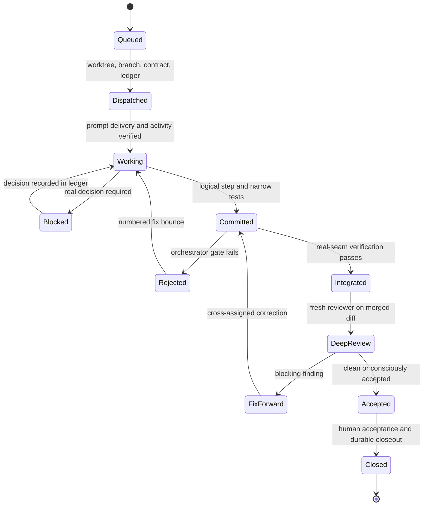

# Building an Agentic Engineering Control Plane That Can Run for Days

**A durable operating system for parallel software agents: isolated work,
traceable state, verified integration, independent review, and explicit human
ownership.**

- **Role:** Sole architecture, workflow design, implementation, and continuous
  operational refinement
- **System shape:** Orchestration, implementation and review workspaces;
  persistent worker lanes; isolated Git worktrees; durable run ledgers;
  event-driven monitoring; task-aware model routing; verification and
  fix-forward loops
- **Environment:** cmux, Codex, Git, Python, Markdown, shell automation, test
  runners, and a remote job service for bounded heavy compute

> **Private application-domain code, customer information, and proprietary
> decision logic are intentionally excluded from this case study.**

## Executive summary

Most demonstrations of AI-assisted software development end when a model
produces a plausible diff. That is where the difficult engineering problem
begins.

When several agents work on a real codebase for hours or days, they behave less
like a clever autocomplete and more like a small distributed engineering team.
They can lose context, work from the wrong branch, duplicate another lane's
changes, stop after the first easy task, pass tests that never touch the real
runtime seam, declare an empty report successful, or confidently implement a
field that no production consumer ever reads. A terminal can look idle while a
worker is still running. A prompt can appear to have been dispatched even
though it remains unsent in the composer. A review can be locally correct and
still miss the behavior of the merged system.

I built `cmux-orchestrate` to make this form of engineering operable. It is a
control plane for persistent, interactive coding agents. A human-owned
orchestration session keeps the product and architectural thread. Dedicated
implementation lanes work in isolated Git worktrees. Separate reviewer lanes
inspect merged diffs with fresh context. A durable Markdown ledger records the
plan, sessions, decisions, verification, remote jobs, findings, and closeout.
Monitors follow branch tips and state transitions rather than repeatedly
reading agent conversations. A Python dispatch tool treats prompt delivery as
a verified protocol rather than a keystroke.

The system can operate as one continuous plan owner or as a fleet of specialized
lanes. A recorded 14-lane wave used nine primary implementation lanes and five
lower-cost lanes, produced approximately ten verified merges in 90 minutes,
and surfaced four blocking review verdicts before the affected work could move
further through the delivery chain. The current registry contains 18 reusable
terminal surfaces across three workspaces. My tracked model usage since
mid-February 2026 has crossed roughly 90 billion tokens including cache hits.
That number is not a measure of productivity. It explains why rare orchestration
failure modes became ordinary engineering problems that had to be designed out.

The central idea is simple: **model capability does not create a reliable
engineering process. Reliability comes from system design around the model.**

## The problem is not generating code; it is controlling concurrent change

A single coding agent can rely on the human to remember the goal, notice when
the session drifts, inspect the diff, run the right tests, and ask for a second
opinion. That arrangement stops scaling once several streams are active.

The human becomes a manual scheduler. Relevant decisions exist only in chat
history. Two agents can edit the same files from different assumptions. A
finished worker sits idle because nobody noticed its last commit. Another
worker continues on a stale base. Review happens against a branch that is still
moving. After context compaction, the orchestrator remembers the broad plan but
not which lane owns which branch or why a finding was rejected.

Adding more agents increases capacity only if coordination cost grows more
slowly than the fleet. Otherwise parallelism creates more unfinished work, more
merge conflicts, and more plausible-looking mistakes.

I therefore stopped treating each session as a conversation and started
treating it as an unreliable worker process with an identity, a lease, a state,
an input contract, observable outputs, and a bounded authority. The control
plane is built around five questions:

1. What exact outcome does this lane own?
2. Which code state may it change?
3. How will the system know that work actually started and finished?
4. Which evidence is required before the result advances?
5. Which decisions must remain with a human?

## Three roles prevent one context from becoming judge and jury

The operating model separates orchestration, implementation, and review.

The **orchestrator** owns the problem definition, dependency graph, scope,
cross-lane decisions, integration order, and final acceptance. It does not spend
its context writing every implementation. It maintains the global view and
converts new evidence into the next highest-value action.

The **implementation lane** owns a complete approved plan or a clearly bounded
work unit. It edits code in its own worktree, commits logical steps, runs narrow
verification as it goes, and reports blockers through the ledger. For a
multi-unit plan, the default is continuous execution to the completion marker,
not a pause after every unit.

The **reviewer** begins with fresh context and a different mandate. It reads the
plan, ledger, merged diff, and verification artifacts. It reports findings
first and does not silently become a second implementer. Fixes return to the
author or another explicitly assigned lane.

This split is not ceremony for its own sake. Long-running implementation
benefits from warm context. Review benefits from independence. Orchestration
benefits from not being filled with file-level implementation detail. The
ledger is the boundary that lets the three roles exchange facts without
requiring them to share one increasingly degraded conversation.

## The run ledger is executable coordination state

Terminal titles and chat memory are not durable enough to coordinate work that
survives restarts, context compaction, model changes, and several active
branches. Every run therefore gets a repository-local Markdown ledger before
implementation begins.

The ledger records the task and plan, canonical session, workspace and surface
references, branch ownership, model and role, current status, open questions,
decisions, verification evidence, review findings, remote compute jobs, and
closeout state. Unknown session identifiers are temporary states that must be
backfilled. A reviewer can see which implementation is authoritative. A
resumed orchestrator can reconstruct the fleet without relying on memory. A
remote result can be reused instead of submitted twice.

The ledger is committed as part of the code history. A handoff to review, a pull
request, or a final closeout is blocked while the ledger is untracked or dirty.
This turns process state into the same kind of durable artifact as code and
tests. It also preserves rejected findings and their reasoning, so a fresh
reviewer does not repeatedly reopen a decision that has already been
adjudicated.

Blockers use the same path. An implementation lane writes the question, the
available evidence, and a proposed handoff, then stops. The orchestrator may
resolve ordinary engineering questions from the plan and repository. Product,
risk, scope, or irreversible operational decisions return to the human. The
agents can be autonomous about execution without acquiring authority they
should not have.

## Git worktrees turn parallelism into isolated leases

Each lane is a tuple of terminal surface, worktree, branch, and state. This is a
stronger unit than “agent number four.” The worktree defines what the lane may
edit; the branch provides an inspectable output; the surface provides the
interactive process; the ledger binds all of them to the assignment.

Before any Git operation, a new terminal must change into the intended worktree
and print both its working directory and branch. This check exists because a
new pane inherits the workspace's current directory, which may be another
agent's live worktree. Without the gate, creating a branch can switch the code
state underneath a different worker.

Lanes are also forbidden from copying another in-flight unit's files into their
own branch. That shortcut creates stale duplicates and later add/add conflicts.
Dependencies move through the integration branch. When a required contract
lands, the dependent lane receives the new commit and exact symbols rather than
a private copy.

This model makes ownership visible. It also allows capacity to move. A work unit
has an owner in the ledger, but a fix round can run on any idle surface by
creating a new branch from the current integration tip. The terminal is
capacity; the branch and ledger carry the identity.

## Dispatch is a protocol, not a paste operation

The first version of the workflow sent a prompt to a terminal and pressed
Enter. At fleet scale that was not reliable enough.

Fresh sessions sometimes consumed the Enter key during reset. A newline inside
the pasted prompt created a multi-line composer entry instead of submitting it.
Narrow panes occasionally dropped the paste. A command without an explicit
workspace targeted the orchestrator's surface and failed. A worker could appear
idle because the terminal renderer truncated or distorted the activity line.

I moved those lessons into a Python CLI called `cmux-fleet`. Dispatch now runs
in phases across the entire target set:

1. Resolve every lane to an explicit workspace and surface.
2. Reset all requested contexts and wait for the reset animation to settle.
3. Paste prompt text without a trailing newline.
4. Verify that an anchor from the prompt is visible in each composer.
5. Re-paste only where delivery failed.
6. Send Enter as a separate operation.
7. Verify that each lane reached a working state.
8. Retry only the stragglers and return a non-zero result if any lane did not
   start.

Prompts are passed as subprocess arguments rather than interpolated through a
shell, removing an entire class of quoting failures around apostrophes, dollar
signs, backticks, and equals signs. A single JSON file can carry a different
prompt for every lane, allowing a whole wave to be reset, dispatched, and
verified together.

The same principle applies to monitoring. Activity detection uses stable
present-tense signals and elapsed timers, not one fragile terminal string.
State changes are debounced across two reads so an animated spinner or one
truncated frame does not emit a false idle event. Screens are read only to
confirm kickoff, identify a genuinely idle lane, or diagnose a stall. Branch
tips and durable state are the primary signals.

## A fleet needs a scheduler, not constant screen watching

Persistent lanes are cheaper to operate than repeatedly creating new ones, but
only if idle capacity is noticed and assigned quickly. The orchestrator keeps a
graded queue and runs the same event-driven cycle on every wake:

- drain landed commits and terminal job events;
- verify finished work from the lane's actual tree;
- merge, reject, or send a complete fix bounce;
- assign every idle lane the highest-value legal next task;
- update the task board and durable ledger;
- end only when no idle lane can take queued work.

One monitor watches branch-tip changes. Another watches remote jobs until they
reach a terminal state. A debounced all-lane monitor reports working-to-idle
transitions. These events are scheduler inputs; they are not invitations to
micro-manage the agents' chain of thought.

The queue is dependency-aware. If one plan owns a tightly coupled chain, one
agent drives it continuously instead of fragmenting it to make every pane look
busy. When forward work is genuinely blocked, spare lanes review completed
units, harden real seams, or advance the critical-path contract that unlocks
several successors. Parallelism is treated as a resource allocation problem,
not as a target metric.

## Model routing is an engineering and economic policy

I do not build the process around loyalty to one model. Lanes are routed by
task risk, horizon, context need, and verification cost.

Long-horizon implementation and subtle contract work go to the strongest
suitable coding lane. Fresh review uses a high-reasoning configuration with a
different context. Lower-cost or open models can handle evidence extraction,
documentation, mechanical test extensions, and other bounded high-volume work.
The assignment changes when the work changes; the controls do not.

Smaller models are useful precisely because the system does not pretend they
are interchangeable with frontier models. Their outputs receive additional
factual and wiring checks. Prose claims are verified against current code.
Apparent implementations are inspected for actual runtime dataflow. The goal is
not to prove that a cheaper model is universally equivalent. It is to engineer
a task contract and verification envelope in which its output is economically
useful.

This makes model upgrades less disruptive. A new model can enter a lane role
and be evaluated against the same dispatch, state, test, review, and acceptance
boundaries. The durable asset is the operating system around the models.

## Verification assumes that plausible code may be inert

An agent's “done” message is a scheduling event, not proof. Before integration,
the orchestrator enters the lane's worktree, checks the actual diff, and runs
the new tests plus the relevant standing gate. Verification is designed around
the failure modes that ordinary unit tests frequently miss.

For every new field, accumulator, registry, flag, or event, the reviewer searches
for both its producer and its consumer outside tests. A writer with no runtime
reader is not an incomplete optimization; it is inert software.

Every fallback such as `getattr`, `hasattr`, or dictionary access with a default
is checked against the real object definition. A misspelled or nonexistent
field that always returns zero can make a report look valid while fabricating
its contents.

New outputs must contain meaningful values on the smallest input that activates
the behavior. “The JSON file exists” is not evidence that the feature works.
Tests must travel through the real configuration, builder, and consumer seam
rather than constructing a convenient mock that bypasses the production path.
New constants and small helpers are searched against the existing codebase
before another competing implementation is accepted.

When a test fails, the same selector is run against the current integration
tree before the branch is blamed. Pre-existing failures are recorded and routed
to the correct owner rather than used to block unrelated work or silently
ignored.

These checks came from real defects: diagnostics that were written but never
serialized, configuration fields that did not reach the runtime view, defaults
that always fired, and tests that proved only their own fabricated namespace.
The solution was not a longer prompt. It was a stronger acceptance contract.

## Fresh review happens on the integrated reality

At higher lane counts, holding every change for a full deep review makes the
review queue the throughput ceiling. Skipping independent review would remove
the most important quality boundary.

The control plane therefore separates two gates. First, the orchestrator runs a
bounded pre-merge verification: changed tests, standing regressions, real-seam
checks, and the wiring audit. The change then merges into an integration branch,
not directly into an irreversible production state. A fresh reviewer inspects
the exact merged diff. Blocking findings become fix-forward branches on top of
that state and return through the same verification loop.

Review is report-first. The reviewer does not edit merely because it found a
problem. The orchestrator confirms each finding against the code, chooses the
cheapest correct layer for the fix, and records rejected suggestions with a
reason. This prevents a reviewer from turning a local concern into a riskier
architectural change.

The 14-lane operating wave demonstrated the value of this split. Four blocking
verdicts were found while the fleet continued moving. Review remained
independent without forcing all implementation capacity to wait behind one
serial ceremony.

## Long-running operation requires recovery by design

Multi-day work eventually outlives every context window. The orchestrator
therefore compacts itself deliberately at safe moments. Before compaction it
preserves the baseline, lane map, settled work, queue, and known traps. The
repository ledger remains the authoritative record; the compacted prompt is a
working cache.

The same recovery principle applies to remote compute. Every job is recorded
with its purpose, command or target, submitting stage, identifier, status, and
artifact paths. Before a new job begins, the ledger is checked for an equivalent
completed run. Long tests can continue outside the laptop session without
becoming invisible or being submitted twice.

Closeout is also explicit. Human acceptance is recorded, remaining learning is
compounded, the final ledger must be clean, and only worker surfaces with known
identities are closed. The orchestration surface remains the final audit and
decision point. Worktrees and workspaces are not destructively removed as an
incidental side effect.

The result is a system that can stop and restart without pretending continuity.
It reconstructs continuity from durable state.

## Outcome

`cmux-orchestrate` changed my use of coding models from repeated pair-programming
sessions into an engineering operating model. I can move between one deep plan
owner and a large mixed fleet without changing the core controls. Work is
isolated, observable, reviewable, resumable, and connected to an explicit human
decision boundary.

The throughput is real, but it is not the most important outcome. The stronger
result is that higher throughput did not require lowering the definition of
done. The system became stricter as it scaled: delivery is verified, runtime
dataflow is inspected, reviews use fresh context, fix rounds remain traceable,
and model choice is separated from engineering trust.

It also changed how I think about AI engineering. The difficult skill is not
knowing one perfect prompt or selecting one universally best model. It is
designing the environment in which different models can make useful progress,
detecting when their apparent progress is false, and keeping the human focused
on decisions that deserve human judgment.

## Engineering principles that transfer beyond this system

1. **Treat agents as unreliable distributed workers.** Give each one identity,
   state, authority, observable outputs, and a recovery path.
2. **Persist coordination outside conversation history.** Plans, sessions,
   decisions, proof, and findings must survive context loss.
3. **Isolate concurrent change physically.** A worktree and branch are safer
   ownership boundaries than a prompt saying “do not touch.”
4. **Verify that dispatch happened.** Delivery, submission, and working state
   are separate events.
5. **Schedule from durable events, not terminal theater.** Branch tips, ledgers,
   and job states are stronger signals than constant screen polling.
6. **Route models by risk and task shape.** Use cheaper capacity where the
   acceptance envelope makes it safe; spend reasoning where errors are subtle.
7. **Never accept output shape as output correctness.** Prove non-empty content
   and trace new data from a real producer to a real consumer.
8. **Keep implementation and review independent.** Warm author context and
   fresh reviewer context solve different problems.
9. **Review the integrated system.** Branch-local success does not prove the
   merged runtime.
10. **Use fix-forward loops instead of hiding findings.** A blocking verdict is
    useful evidence when it becomes a traceable correction.
11. **Scale the queue, not just the worker count.** Dependency-aware task
    generation and acceptance capacity determine useful parallelism.
12. **Keep irreversible decisions human-owned.** Agents may execute broadly;
    people retain product, scope, risk, release, and final acceptance.

That is the core of my Agentic Engineering practice: not “I ask several models
to write code,” but **“I engineered a software delivery system in which a fleet
of probabilistic workers can operate for days while their changes remain
isolated, evidence-backed, independently reviewed, and accountable to a human
owner.”**
