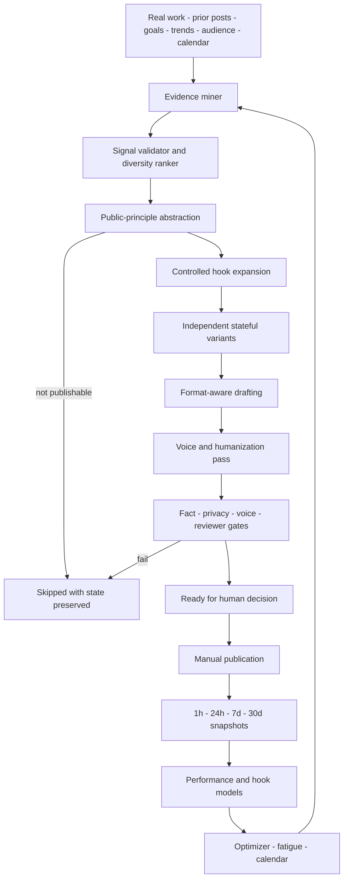
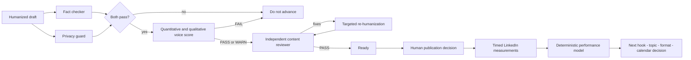

# Building a Content Engine That Learns from What Actually Worked

**An event-driven, multi-agent content operating system that mines proof from
real engineering work, turns it into public ideas, protects factual and stylistic
integrity, and feeds outcome data back into the next decision.**

- **Role:** Sole architecture, product design, and hands-on implementation
- **System shape:** Evidence mining, abstraction, controlled hook variation,
  format-aware drafting, humanization, quality gates, manual publication,
  outcome tracking, statistical learning, and content planning
- **Environment:** Python, Pydantic, MongoDB, Claude Agent SDK, LangChain,
  FastAPI, Jinja, Typer, LinkedIn API, SciPy, and `python-statemachine`

> **Private source material and unpublished drafts are intentionally excluded
> from this case study.**

## Executive summary

Most AI content products optimize the easiest part of the problem: generating
more text. That was not the system I wanted to build. Writing another plausible
LinkedIn post is cheap. Knowing which event from weeks of engineering work is
worth publishing, which facts can support it, how to make it useful to someone
outside the original project, whether it still sounds like the author, and what
the audience actually responded to are much harder problems.

I built Content Engine as a closed-loop content operating system. It mines
structured evidence from real work, prior content, goals, performance models,
audience signals, calendar constraints, trends, and competitor gaps. It rejects
weak signals, transforms implementation detail into transferable principles,
creates controlled hook and format variants, drafts with supporting proof,
removes formulaic AI writing, and stops content at several quality gates before
it can become ready.

The automation deliberately ends at `ready`. Publishing remains a manual,
irreversible human action. Once a post is public, the system takes over again:
LinkedIn metrics are collected at defined time windows, converted into
comparable performance features, and analyzed for the combinations, hook
formulas, formats, topics, and timing patterns that should influence the next
mining and planning cycle.

A preserved development dataset contains **262 stateful pipeline items**, **11
hook formulas with 55 reusable templates**, **17 LinkedIn metric records**, two
content-performance models, nine detected fatigue signals, and five content
pillars. The significance is not the number of drafts. It is that every item,
variant, quality decision, publication reference, and later outcome belongs to
one traceable system rather than a collection of disconnected prompts.

The core engineering question became: **How do you let agents do most of the
content work without allowing them to invent the source story, erase the
author's voice, expose private context, or optimize blindly for yesterday's
metric?**

## The difficult part is deciding what deserves to become content

A generic content generator starts with a topic such as “write something about
AI agents.” Content Engine starts with evidence. Its mining stage can inspect
compact projections from code activity, engineering conversations, daily and
weekly state, project documents, work summaries, recurring patterns, current
trajectory, prior LinkedIn posts, and other structured sources.

External intelligence can be added, but it is not allowed to replace the
author's own experience. Open calendar slots, recent trends, content-performance
models, optimization recommendations, audience segments, and competitor gaps
provide context around a real internal signal. The intended order is evidence
first, framing second.

That distinction matters because the strongest professional content normally
comes from something that actually happened: an architecture failed, a platform
constraint forced a better design, an optimization produced a measurable
change, or a repeated delivery problem revealed a reusable principle. A model
can help recognize and communicate that event, but it should not manufacture
the event itself.

The miner therefore operates as a signal extractor. It looks for concrete proof
points and source references rather than beginning with hooks or finished copy.
A validator checks whether each candidate has practitioner relevance, sufficient
evidence, and a lesson worth developing. A separate ranker applies a score floor
and a diversity penalty so one temporarily dominant topic does not consume the
entire output.

Input is compressed before it reaches the model. Conversations are reduced to
summaries, insights, and decisions. Documents become titles, topics, and
summaries. Code activity becomes narratives, themes, achievements, and commit
counts. Prior LinkedIn posts are bounded to compact performance and preview
data. External trend and competitor text is length-limited and checked for
prompt-injection patterns before it becomes context.

The result is not a post. It is a typed `IdeaData` record containing a theme,
pillar, post type, proof points, source collections, score, hook metadata, and
optional calendar or series relationships. The system delays prose until it
has decided that the underlying signal deserves prose.

## An abstraction layer separates useful principles from private implementation

Real engineering evidence is often too specific to publish directly. It may
contain internal names, customer context, low-level debugging detail, or a fact
that only matters inside the original project. Simply paraphrasing it does not
make it useful or safe.

Content Engine inserts a dedicated abstraction stage between mining and
drafting. The abstractor classifies every signal as one of four types:

- **direct professional:** already suitable for a professional audience;
- **engineering principle:** a specific implementation reveals a transferable
  technical lesson;
- **concept story:** the event can carry a broader mental model or narrative;
  or
- **not publishable:** the signal is too private, too weak, or too dependent on
  unavailable context.

For publishable signals, the stage produces a one-sentence principle, an
audience frame, rewritten proof points, a possible hook angle, and an audience
relevance score. Non-publishable signals move to `skipped` rather than being
forced through a creative-writing prompt.

This layer changed the product from “turn my private data into posts” into
“discover which private events contain a public lesson.” It also creates a
clean responsibility boundary. Mining establishes what happened. Abstraction
decides why someone else should care. Drafting decides how to communicate it.

## A persistent state machine turns prompts into a recoverable production flow

Every content item is a Pydantic document with an explicit lifecycle. Parent
signals move from `mined` to `abstracted` and then `expanded`. Expansion creates
independent child variants. Each child moves through `drafted`, `humanized`,
`quality_ok`, and `ready`, or ends in `skipped` when the evidence or quality is
insufficient.

The state machine does more than name folders. Entering a state invokes the
bounded operation responsible for that transition. An item resumed after a
crash starts at its persisted stage without re-running earlier callbacks.
Parent expansion ends the parent flow and leaves child variants to be processed
independently. A quality failure cannot accidentally continue into review.

An asynchronous worker polls MongoDB every 30 seconds and processes up to three
items concurrently by default. On startup, it sweeps every actionable stage so
drafted or humanized work left by a previous interruption can continue. During
normal operation it looks for newly mined items. Synchronous agent stages run
in worker threads, rate-limited items can be requeued, and shutdown drains the
queue before exit.

The most important transition is the one the machine does not own. `posted` is
not a worker state. A user records the public URL only after deciding to publish
the ready item. This keeps the agents fast and autonomous on reversible work
while preserving human authority over the irreversible public act.

## Controlled variation replaces random prompt creativity

Content testing requires variation, but asking an LLM to “write five different
hooks” produces differences that are difficult to classify or learn from.
Content Engine treats the hook as structured experimental metadata.

Its hook library contains 11 named formulas and 55 templates across ten post
types. Template selection starts deterministically. A context recommendation
can boost the formula best suited to a pillar and post type, while baseline
scores provide a stable default. The system chooses five formulas, selects the
most appropriate template for each, and uses one small model call to fill the
template slots from the signal's actual proof points. Each result becomes an
independent pipeline item with a parent ID and a recorded formula.

A second experimentation path supports explicit hook tests. It can choose two
or three formula families randomly while data is scarce. Once the effectiveness
model has enough samples, it uses Thompson sampling to balance exploitation
with an exploration slot. The model calculates Bayesian credible intervals and
uses 10,000 Monte Carlo draws to estimate the probability that each formula is
best. Formula-by-pillar and formula-by-post-type matrices are only populated
when their cells have enough observations.

This creates a learnable unit. The system can compare “contrarian” with
“question” or “story” for a given kind of post. It is no longer attempting to
learn from five unlabelled strings whose differences are impossible to
describe.

## Drafting is format-aware and proof-aware

Variant generation chooses the entry point; the drafting team builds the
content. The main drafter can delegate evidence gathering and style analysis to
specialist agents. It receives the idea, abstraction, proof points, relevant
historical context, and examples of top-performing published work.

The output contract depends on format. Text posts produce a bounded draft.
Carousels produce a validated script of six to twelve slides with word-count
limits, slide roles, visual notes, and a call to action. Polls and video scripts
use their own specialists. Separate transformers can adapt suitable content
into a thread, newsletter, carousel, or another platform tone while preserving
the link to the original source item.

Format routing prevents one generic prompt from pretending that a text post, a
carousel, and a poll are the same writing task. Pydantic models enforce the
mechanical constraints the model should not negotiate, such as slide counts,
headline lengths, allowed states, IDs, formats, and target-platform metadata.

The same principle applies to proof. The drafting stage has access to compact
structured facts and a data-research agent rather than an instruction to “add
some impressive numbers.” Numerical and factual claims remain traceable to the
input bundle that produced the idea.

## Humanization is a measurable stage, not a prompt saying “sound human”

Model-generated writing often fails through accumulated small patterns:
uniform sentence length, excessive formatting, passive constructions, generic
transitions, low vocabulary variation, and a voice that resembles every other
AI-generated post.

Content Engine gives humanization its own stored result. The humanizer can
rewrite the draft, record the changes it made, assign a score and verdict, and
return a breakdown across eight dimensions. Four dimensions inspect common AI
tells and human signals. Four deterministic text metrics measure reading level,
passive-voice ratio, sentence-length variation, and vocabulary diversity.

Voice consistency is evaluated against a profile calculated from the author's
top-performing published posts. The profile measures average sentence length,
sentence variation, vocabulary diversity, contractions, question frequency,
first-person frequency, passive voice, reading level, and formatting style. A
seven-day cache avoids recomputing the baseline for every draft.

The result is not a demand that every post reproduce one historical style.
Voice scoring can pass, warn, or fail. The gap analysis shows where the new
draft differs so the reviewer can distinguish intentional variation from a
generic model voice.

## Quality is a sequence of independent objections

One agent should not write a post and then approve its own work. Content Engine
uses several quality stages with different responsibilities.

The fact checker and privacy guard run in parallel. The fact checker extracts
claims from the draft and compares them with a bounded data dump assembled from
the available structured sources. The privacy layer combines configured
rule-based checks with an agent pass for contextual violations. If either gate
fails, voice evaluation is skipped because there is no value in polishing a
draft that should not advance.

Only after fact and privacy checks pass does the voice-consistency agent compare
the draft with the published profile. The combined gate accepts voice `PASS` or
`WARN`, but not `FAIL`. A separate content reviewer then checks the humanization
score, narrative structure, audience positioning, privacy compliance, and
line-level fixes. Failed reviews can trigger a focused re-humanization pass with
the reviewer's feedback before another review.

The structure matters more than the particular model behind any stage. Each
agent has a bounded objection it is allowed to raise. The post reaches `ready`
only after independent checks agree that it is supportable, safe enough for
review, recognizably authored, and structurally useful.

## Publication creates evidence for the next cycle

The system does not treat a published post as a completed workflow. A collector
tracks LinkedIn performance at approximately one hour, 24 hours, seven days,
and 30 days. Each snapshot stores impressions, reach, reactions, comments, and
reshares, then derives engagement rate, viral coefficient, reach efficiency,
comment quality, and changes from the previous comparable snapshot.

These calculations are pure Python rather than LLM interpretation. The
performance model joins public outcomes with the structured choices recorded in
the pipeline: post type, hook formula, pillar, format, day of week, and other
attributes. It calculates baselines, performance relative to baseline, trends,
and two-attribute combinations such as post type plus format or hook plus
format.

Confidence is explicit. Fewer than five observations remain insufficient; five,
ten, and twenty observations move through low, medium, and high confidence.
Small attribute groups are not silently presented as universal rules.

The same data can detect fatigue. For every post type, hook, pillar, and format,
the engine checks whether engagement is declining over time and whether the
negative slope is statistically significant. The resulting signal contains the
slope, p-value, sample size, severity, analysis period, and a proposed action.
Unacknowledged fatigue signals can be excluded from the next content calendar
instead of allowing an agent to repeat a previously successful formula until it
stops working.

A performance optimizer translates the deterministic model into structured
recommendations across format, pillar, post type, hook, timing, and topic. Each
recommendation records the evidence, confidence, expected impact, and whether
it was applied. The next miner receives the latest model and recommendations as
context, closing the loop between production and outcome.

## External intelligence changes the frame, not the source of truth

The system can scan practitioner sources in parallel, normalize and deduplicate
the results, score relevance against the content pillars, and store trend
signals above a defined threshold. Competitor posts can be classified by post
type, hook, format, pillar overlap, and estimated engagement structure. A weekly
report distinguishes crowded topics from possible content gaps and records a
differentiation angle.

This intelligence is intentionally secondary. Trend relevance does not prove
that the author has something useful to say. Competitor classification does not
become evidence for a personal claim. These signals help decide whether a real
experience has a timely angle or whether a topic needs a different framing.

The calendar applies similar discipline to planning. It can generate three to
five weekly slots while checking content-mix, format rotation, pillar balance,
hook diversity, timing, type diversity, optimizer recommendations, and fatigue
exclusions. New mined items can be assigned to compatible open slots. This
prevents a locally good draft from distorting the broader publishing mix.

## Operations remain inspectable

The system can run as a CLI pipeline, an always-on worker, or through a small
FastAPI dashboard. The dashboard presents the item lifecycle as a Kanban view
and summarizes available LinkedIn analytics. MongoDB stores the canonical
pipeline state, while Pydantic validates records at every storage boundary.

The standalone codebase contains 109 Python modules across agents, models,
storage, collectors, calculators, transformations, CLI, and dashboard, plus 45
test modules. A bounded repository test run currently executes hundreds of
checks across the state machine, storage, analytics, hooks, scheduling, mining,
humanization, and integrations.

More importantly, the operational model supports interruption. A long agent
run does not need to complete the entire content pipeline in one process. State
is stored after each meaningful transition. Backlogs are resumed. Variants are
independent. The final public action is never hidden inside worker automation.

## Outcome

Content Engine turns an unstructured personal-brand activity into an
inspectable software system. It can trace a public post back through its hook
formula, variant parent, abstracted principle, proof points, mined source, and
quality decisions. After publication, it can attach outcome data to those same
choices and use the evidence to alter future hooks, formats, topics, and
calendars.

The project does not need a fabricated growth percentage to be valuable as an
engineering case. The difficult result is the control system itself: agents can
perform most reversible work autonomously, deterministic code owns constraints
and statistics, weak or unsafe material can stop, and the human remains the
owner of the public decision.

It also demonstrates a recurring theme in how I build. I do not view agents as
chat interfaces placed in front of an existing workflow. I redesign the
workflow around bounded responsibilities, typed state, independent review,
failure semantics, durable execution, and feedback from the real environment.

## Engineering principles that transfer beyond content

1. **Start with evidence, not generation.** A model should communicate events
   that happened, not invent events that would make good copy.
2. **Separate facts, relevance, and expression.** Mining, abstraction, and
   drafting answer different questions and should not be one prompt.
3. **Make probabilistic work stateful.** Persisted transitions make agent
   pipelines resumable, inspectable, and safe to operate over time.
4. **Label variants so outcomes can teach you something.** Controlled formulas
   create learnable experiments; unstructured alternatives do not.
5. **Use independent objections as quality gates.** Fact, privacy, voice, and
   audience structure require different reviewers.
6. **Keep irreversible actions human-owned.** Automation can reach `ready`;
   public release remains an explicit decision.
7. **Measure outcomes at meaningful horizons.** One-hour response and 30-day
   value are different signals and should not be collapsed into one snapshot.
8. **Attach confidence to optimization.** Small samples are observations, not
   strategy.
9. **Detect fatigue as well as success.** A feedback loop must know when to stop
   exploiting a pattern that used to work.
10. **Let external trends shape timing, not truth.** Relevance can come from the
    market; credibility must come from the underlying evidence.

That is the core of Content Engine: not “I made an AI that writes LinkedIn
posts,” but “I built a controlled agentic production system that can turn real
engineering work into public knowledge and learn from what happens after a
human chooses to publish it.”
