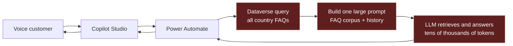
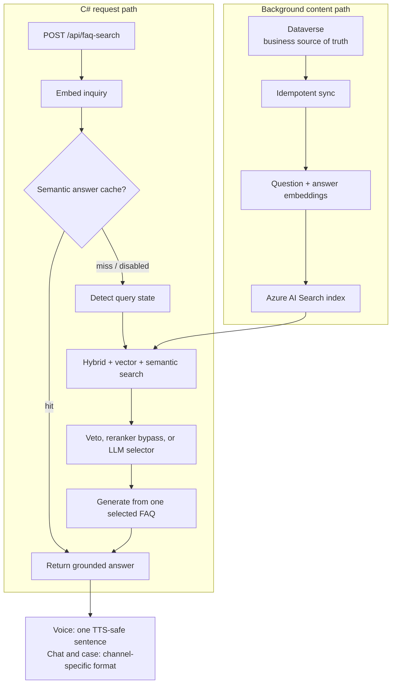

# From 30 Seconds of Silence to a 2.6-Second FAQ Engine

**An independently designed C# RAG engine for a latency-critical customer-service voice bot.**

- **Role:** Sole architecture, implementation, and optimization
- **Runtime:** C# / .NET 8 isolated Azure Function
- **Environment:** Microsoft Copilot Studio, Dataverse, Azure AI Search, Azure
  OpenAI, Power Automate, Terraform, Application Insights

> **Client and FAQ content have been anonymized.**

## Executive summary

The customer already had a FAQ solution that produced good answers. Its problem
was time: the production path could take approximately **30 seconds** from the
question to the generated answer. That can be survivable in an asynchronous
channel. In a voice bot it becomes a long, unnatural silence during which the
customer does not know whether the system is thinking, broken, or disconnected.

The underlying Microsoft and Dataverse implementation treated the language
model as both database and answer generator. On every request it loaded the
country-specific FAQ collection, serialized the records into a prompt, and
asked the model to find and formulate the answer. A first own variant brought
the observed path down to roughly **14 seconds**, but the architecture still did
too much corpus-wide and sequential work for a real-time conversation.

I independently designed, implemented, and optimized a custom RAG engine in C#.
Dataverse remained the business-owned source of truth, but indexing moved to a
background path. The synchronous path became a bounded sequence: embed the
question, retrieve a small candidate set through hybrid search, select one FAQ,
and generate a short channel-specific answer from that source.

In a cross-channel comparison, the new architecture averaged **3.3 seconds**
versus **9.6 seconds** for the prior variant. A more recent 29-request live run
averages **2,608 ms**, with a **2,286 ms median**, and all 29 requests return
HTTP 200. The measurement covers the complete backend path from query embedding
to the generated, grounded response.

The interesting result is not merely that the engine is faster. It makes the
choice of source observable, keeps content gaps distinct from retrieval errors,
and refuses latency shortcuts that improve a stopwatch by making the answer
worse.

## Three iterations of the same problem

| Iteration | End-to-end latency | Architectural state |
|---|---:|---|
| Microsoft/Dataverse production path | Approximately 30 seconds | Full FAQ collection loaded and processed for every question |
| First own variant | Approximately 14 seconds | Faster, but still dominated by corpus-wide and sequential work |
| Final C# RAG engine | Usually 2-3 seconds; latest run averages 2,608 ms | Indexed retrieval, bounded selection, and single-source generation |

The first improvement proved that the latency was not an unavoidable property
of the model. The second required a more fundamental decision: the FAQ corpus
could no longer be part of every request.

## The original architecture used an LLM as a search engine

For each inquiry, the old flow called Power Automate, queried Dataverse for all
matching country and language records, built one large prompt, and sent the
entire corpus through AI Builder. With roughly 400 FAQs and an estimated 200
tokens per question-answer pair, one request could carry approximately 80,000
input tokens before conversation history and instructions were added.

That created four coupled problems:

1. **Latency grew with corpus size.** The model had to read every FAQ to answer
   one question.
2. **Cost grew with corpus size.** Repeated questions paid the entire prompt
   cost again.
3. **The model performed retrieval and generation.** It spent its most expensive
   compute deciding which record to read.
4. **The system had a hard ceiling.** At the documented assumptions, roughly
   700 FAQs already exceed a 128K context window.

The sequential request path added more delay around the model call: Copilot
Studio handed off to a Power Automate flow, the flow loaded and serialized
hundreds of records, AI Builder processed the prompt, and the response travelled
back through the same stack.

The model was not intrinsically too slow. It was being asked to read an
encyclopedia before answering a single question.

## The architectural move: take the corpus off the hot path

The redesign separated content maintenance from question answering.

Dataverse stayed the FAQ system of record so business users could keep their
existing publication workflow. A background synchronization path cleans the
HTML, generates question and answer embeddings, and upserts the documents into
Azure AI Search. Updates can be replayed idempotently, and cache entries can be
invalidated when their FAQ changes.

The caller now invokes a .NET 8 isolated Azure Function directly. The function
does not retrieve the Dataverse table. It embeds the query once and uses Azure
AI Search to combine:

- BM25 lexical matching;
- vector similarity over question and answer embeddings;
- semantic reranking;
- hard country and language filters;
- exclusion of FAQs already answered in the conversation; and
- an optional, content-owned intent boost for close sibling FAQs.

The initial RAG design reduced the model context to the top three to five FAQs.
The later quality-tuned engine retrieves up to 20 candidates, exposes no more
than 10 to source selection, and still sends only the selected FAQ answer into
customer-facing generation. Corpus size is no longer prompt size.

## The current C# hot path

One HTTP function owns the complete request pipeline and returns the answer plus
diagnostics about how it was produced.

### 1. Embed once

The engine builds the search query from the current inquiry and a bounded amount
of conversation history. Long histories are capped so they cannot silently
turn into a new latency problem. Azure OpenAI generates one query embedding.

### 2. Retrieve with complementary signals

Azure AI Search executes one hybrid query over text and vector fields and then
applies semantic reranking. Country and language are hard filters, not soft
prompt instructions. The current configuration retrieves up to 20
documents and caps the selector slate at 10.

This matters for near-duplicate FAQ siblings. Semantic similarity can place
"I have already paid" close to "I received a payment reminder," even though
the customer states are opposite. Retrieval recall and source selection are
therefore measured separately.

### 3. Spend LLM latency only on ambiguous selection

When the top reranker result clears both a score threshold and a margin over the
second candidate, the function accepts it directly and skips the selector LLM.
Very low-confidence requests follow the explicit always-answer policy and use
the best retrieved FAQ. Ambiguous middle cases invoke a separate source
selector.

The selector decision is visible in the response as `selectionMethod`; it is
not buried inside the final prose. In the current 29-request replay, 21 requests
used the deterministic high-confidence reranker path. Only the ambiguous rows
paid the selector-model round trip.

For recurring business-state confusions, the engine can use reviewed metadata
instead of adding a larger general model. A query-state detector identifies a
small set of states from a generated but reviewed cue set. Search may
boost matching FAQ tags, and a narrow veto can remove a candidate whose curated
state directly contradicts the inquiry. These mechanisms are feature-gated and
their behavior is driven by packaged data rather than scattered case-specific
branches in the C# request path.

### 4. Generate from one observable source

The answer model receives the selected FAQ as its source of truth. Voice output
has its own prompt contract: one clear spoken sentence, without links, lists,
abbreviations, or formatting that a text-to-speech engine would read awkwardly.
Chat and case channels use different presentation contracts without changing
the grounding source.

The response records the selected FAQ ID, selection method, candidate counts,
answer method, stage timings, token counts, and whether the answer source is
observable. A fluent answer cannot hide that the wrong FAQ was selected.

### 5. Cache only when conversation state allows it

A semantic answer cache is implemented as a second Azure AI Search index. It can
serve a prior grounded answer for a sufficiently similar one-shot inquiry,
skipping search, selection, and generation. Any request with chat history
bypasses the cache because the cache key does not model conversational state.
Lookup and population failures fall through to the normal pipeline rather than
failing the customer request.

The cache was disabled during the 2,608 ms run, so the number represents the
full generated-answer path.

## Where the 2.6 seconds go

A live run sent 29 requests through the Function against a seeded Azure index.
Every request returned HTTP 200.

| Stage | Average | P50 | P95 |
|---|---:|---:|---:|
| Query embedding | 225 ms | 209 ms | 411 ms |
| Hybrid search | 154 ms | 150 ms | 208 ms |
| Source selection | 346 ms | 0 ms | 1,309 ms |
| Answer generation | 1,873 ms | 1,710 ms | 3,079 ms |
| **End to end** | **2,608 ms** | **2,286 ms** | **4,713 ms** |

The median selection time is zero because high-confidence retrieval can bypass
the selector LLM. The tail is dominated by requests that need model-based
selection or slower answer generation. That decomposition gives the next
optimization decision a real target: changing retrieval will not fix a tail
owned by generation.

An earlier head-to-head test used 21 questions across seven languages, three
channels, and eight countries. The prior variant averaged 9.6 seconds and the
RAG engine averaged 3.3 seconds. Two phone-channel examples moved from 19.9 to
2.3 seconds and from 11.2 to 2.4 seconds.

## Latency was a constraint, not the success metric

Removing an LLM call is easy if answer quality is allowed to collapse. Several
experiments proved why the engine needed a quality-plus-latency gate.

A fast-answer experiment reduced work after source selection but selected fewer
business-expected FAQs. It was rejected. A larger retrieval depth and direct
top-N answer generation created more overclaims. It was rejected and later
removed from the cleaned codebase. Candidate-order reversal showed that the
selector had positional sensitivity but did not provide a useful production
lever. It remained a diagnostic, not another runtime heuristic.

The accepted configuration combined two bounded mechanisms: an intent-tag
boost at retrieval and a narrow metadata-contradiction veto before selection.
In the accepted round, business-ruled source selection improved without adding
hot-path LLM calls, and payment-status questions stopped being routed to a
payment-reminder FAQ.

With the accepted configuration, the engine selects the correct source on
**24 of 24 fixable inquiries**. The automated strict-ID score still prints
22/24 because two rows carry incorrect business labels. In both cases the
workbook points to a sibling FAQ that the business had already marked as wrong,
while the engine selects the FAQ that answers the stated payment-status
question. The remaining five of the 29 reviewed rows are content gaps because
the required FAQ does not exist in the index.

This is not a holdout-accuracy claim. The 29-row fixture is the only available
business-reviewed labeled set and was also used while tuning the bounded
selection mechanisms. It shows how the current configuration behaves on that
known set; broader generalization requires more labeled examples.

Free-form generation is evaluated differently from deterministic source
selection. A fixed seed makes selector replay reproducible, but answer wording
can still vary at temperature zero. Answer changes are therefore measured in
K-run bands rather than certified from one lucky generation. In the accepted
five-run comparison, the mean answer-quality rate moved from 0.77 to 0.90, while
remaining overclaims were preserved as an explicit hardening target.

## Engineering the operating boundary

The C# function is only the synchronous core. The full solution also contains:

- Dataverse lifecycle and publication controls;
- an idempotent FAQ-to-index synchronization pipeline;
- Terraform for Azure resources and runtime configuration;
- a Power Platform connector for Copilot Studio and automation callers;
- per-stage Application Insights telemetry;
- replay tooling over a sanitized business-reviewed fixture;
- deterministic source-selection diagnostics;
- LLM judges for grounding and answer quality;
- a PII-gated asynchronous quality sensor; and
- cleanup records that remove rejected experiments rather than leaving every
  attempted idea in production code.

The quality sensor is deliberately outside the response-critical path. When
enabled, it samples risky decisions and a small part of normal traffic into a
review pipeline. The sink is disabled by default until the data-handling gate is
approved, and a sink failure never changes the customer response.

The price of moving the corpus off the hot path is a larger operating surface:
Azure Functions, model deployments, synchronization, monitoring, and a second
search index when caching is enabled. In return, query latency and prompt size
no longer grow linearly with the FAQ corpus.

## Transferable engineering principles

1. **Retrieve before generating.** Do not pay a language model to scan records
   that a search system can narrow in milliseconds.
2. **Move corpus-wide work off the request path.** Indexing cost can grow with
   the knowledge base; customer latency should not.
3. **Measure source correctness separately from fluent prose.** A polished
   answer generated from the wrong document is still wrong.
4. **Instrument every remote stage.** End-to-end latency tells you that a system
   is slow; stage timings tell you what to change.
5. **Treat latency as a gate, not the sole objective.** A faster path that
   regresses source or answer quality is a failed optimization.
6. **Keep content gaps out of the engine denominator.** Missing business
   knowledge needs content ownership, not another retrieval heuristic.
7. **Delete rejected experiments.** Feature flags are useful while measuring;
   dead alternatives are not architecture.

The visible outcome is a voice bot that no longer leaves the customer waiting
through half a minute of silence. The engineering outcome is a bounded,
observable C# decision pipeline whose latency, source choice, and quality can be
measured independently.
