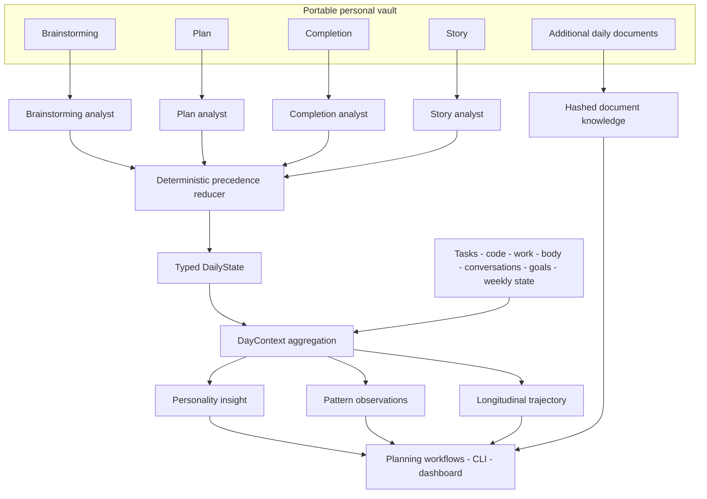
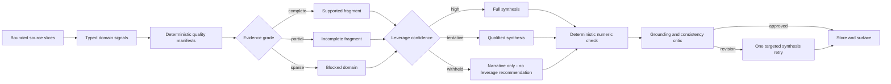

# Building a Personal Data Operating System That Knows When It Does Not Know

**A local-first longitudinal intelligence system that turns private daily
records and objective signals into structured state, behavioral patterns, and
decision support while tracking the evidence quality behind every conclusion.**

- **Role:** Sole architecture, product design, and hands-on implementation
- **System shape:** Portable personal data vault, typed extraction pipelines,
  multi-source daily context, longitudinal analysis, quality gates, local
  storage, automation, CLI, and web dashboard
- **Environment:** Python, Pydantic, MongoDB, FastAPI, Jinja, HTMX, Typer,
  Watchdog, Pi Agent SDK, model-routed LLMs, Microsoft Graph, and Git

> **The underlying records are private by design. This case study explains the
> system and its engineering decisions without exposing personal content.**

## Executive summary

Most personal AI products begin with a chat interface and end with a growing
conversation history. I wanted to investigate a harder question: what would it
take to build an AI system that can reason across months of a person's life
without turning incomplete data, temporary emotions, or model-generated prose
into false certainty?

I built Mirror OS as a private Personal Data Operating System. Its source of
truth is a portable vault of Markdown and YAML files containing daily
brainstorming, plans, completions, stories, research, and other user-owned
records. The system converts these heterogeneous narratives into typed daily
state, combines them with independent signals such as tasks, code activity,
work records, body data, conversations, goals, and weekly reviews, and then
derives personality insights, recurring patterns, and longer-term trajectory.

At the time of this case study, the vault contained **129 dated daily folders
and 1,226 private artifacts spanning eight calendar months**. This is enough
history for the problem to change fundamentally. A model is no longer
summarizing one journal entry. It is making claims about a person from a
longitudinal dataset, where missing sources, inconsistent measurements, and
plausible but unsupported narratives become real engineering risks.

The central design decision was therefore not to maximize the number of AI
features. It was to make every layer answer a more important question: **what
does the system actually know, which evidence supports it, and when should it
withhold a recommendation?**

## Personal AI becomes difficult when memory turns into evidence

A daily reflection is subjective. A Git summary is objective but narrow. A
task marked complete proves one thing and says nothing about energy or intent.
Health data may be precise but absent for several days. A plan describes what
someone intended to do; a completion describes what happened; a story explains
what the day meant afterwards. None of these is the complete truth on its own.

Putting every record into one enormous prompt would create the appearance of
context without a dependable model of evidence. The prompt would grow, old
details would compete with current facts, contradictory sources would be
resolved implicitly by the LLM, and a missing stream could easily be mistaken
for an absence in the person's life.

Mirror OS treats personal intelligence as a data and systems problem instead:

1. Preserve raw records in a format the user can read and edit without the
   application.
2. Extract each source according to what that source can actually establish.
3. Resolve overlaps through deterministic rules rather than model preference.
4. Keep subjective and objective signals separate until context assembly.
5. Record which sources were loaded and which were missing.
6. Measure extraction quality and make weak results visible before they become
   downstream conclusions.
7. Reduce or withhold recommendations when the supporting data is weak.

This architecture makes the AI useful precisely because it does not pretend
that all available data has the same meaning or reliability.

## A portable vault remains the source of truth

The canonical personal record is not trapped in MongoDB or hidden inside a
model provider. It lives in ordinary Markdown and YAML files organized by day.
The user can open the files in an editor, search them with normal tools, copy
them to another system, correct them, or stop using Mirror OS without losing
the original history.

Each day can contain four standard perspectives:

- **Brainstorming:** the starting state, current thoughts, open questions, and
  possible priorities.
- **Plan:** intended actions, time structure, minimum outcomes, and
  commitments.
- **Completion:** what was actually done, what was not done, and measurable
  results.
- **Story:** a retrospective narrative, emotional arc, patterns, wins,
  struggles, and unresolved questions.

Additional daily documents can sit beside those files. A document-discovery
pipeline detects non-primary Markdown, YAML, and text artifacts, calculates a
SHA-256 content hash, skips unchanged documents, and extracts structured
knowledge only when the source changed. The vault therefore supports both a
stable daily schema and open-ended research without forcing every thought into
one database form.

MongoDB is a derived operational store, not the only copy of reality. It holds
typed projections optimized for queries, aggregation, dashboards, and later
analysis. This distinction is important: raw data remains human-readable and
portable; computed state can be regenerated as the extraction logic improves.

## Four specialist analyses become one deterministic DailyState

The daily extractor does not ask one general-purpose prompt to read the entire
folder and decide what matters. Brainstorming, plan, completion, and story are
read independently. Every present section is sent to a specialized analyst,
and the analysts run concurrently. Each returns a partial typed state rather
than free-form prose.

The partial results are then combined by a deterministic reducer. Field
ownership is explicit. The completion and story sources take precedence for
end-of-day assessment. The plan and brainstorming sources own planned actions.
The story has first claim on the day's retrospective state and rating.
Activities and quotations can be concatenated and deduplicated. Carry-forward
updates are applied against existing tasks through controlled status changes.

This reducer solves a subtle but important problem. If two agents disagree,
the final result does not depend on response order, model confidence, or which
piece of prose sounds more convincing. The system follows a visible contract.
Every merge decision is attached to the extraction run as a diagnostic note.

The result is a Pydantic `DailyState` with structured fields for state
transition, energy, planned and completed actions, activities, wins, struggles,
success metrics, assessment, rating, patterns, carry-forward items, and source
provenance. Partial days remain valid. If a section is missing, the system does
not fabricate it simply to fill the schema.

## Context is assembled from independent sources, not flattened prematurely

Once a `DailyState` exists, Mirror OS can enrich it with evidence from other
parts of the system. The `DayContext` loader independently queries up to ten
source groups: daily state, Git activity, body tracking, task state, work
activities, long-running patterns, goals, weekly state, conversations, and
other domain records.

Every source is loaded in isolation. If the work collector fails, the daily
reflection still loads. If no body measurement exists, that absence does not
erase tasks or conversations. The returned context contains both
`sources_loaded` and `sources_missing`, so downstream agents can distinguish
between “the source says zero” and “the system has no source for this.”

That distinction sounds small, but it changes the behavior of personal AI. A
week without measurements must not become “health deteriorated.” A day without
commits must not become “no work happened.” A missing completion must not be
treated as a failed plan. Silence is a data-quality state, not a judgment about
the user.

Context slicing also keeps prompts bounded. A personality-domain analyst sees
the parts of `DayContext` relevant to its domain rather than an indiscriminate
dump of every record. Separate analysts can run in parallel, a synthesizer
combines their fragments, and a critic checks whether the final narrative is
grounded in those fragments. If it is not, the synthesizer receives a targeted
correction and gets one revision.

## Turning individual days into longitudinal intelligence

The useful output of Mirror OS is not a polished summary of yesterday. It is
the ability to compare what was planned, what happened, what the person said it
meant, and what independent signals show across time.

The system builds several layers of derived state:

- **Daily state** gives one date a consistent, typed representation.
- **Personality insight** connects the day with persistent profiles and
  cross-domain behavior without asking one monolithic agent to interpret
  everything.
- **Pattern observations** connect a day's evidence to longer-running patterns
  and update their statistics over time.
- **Weekly state** aggregates energy, ratings, completion behavior, recurring
  wins, struggles, and key insights.
- **Trajectory** combines recent daily and weekly evidence, current goals,
  deterministic metrics, velocity, and per-domain analyses into a longer-term
  view.

This creates a closed loop. Morning planning can use yesterday's completion,
the latest weekly review, active tasks, current patterns, source freshness, and
the most recent trajectory. Evening completion records what actually happened
and selectively enriches the reflection with relevant objective sources. The
new files trigger extraction, and the resulting state becomes evidence for the
next cycle.

The planning workflow is deliberately not optimized for constant
productivity. It encodes rules against shaming language, treats rest as valid,
and asks neutral questions when data is missing. The purpose is not to build a
more invasive habit tracker. It is to create a system that can challenge a
current story with historical evidence while still understanding that human
life is not a throughput graph.

## The AI pipeline has an observability system of its own

Longitudinal analysis becomes dangerous if extraction errors remain invisible.
A fluent model can omit a struggle, invent a causal relationship, or slowly
stop populating an important field after a prompt or schema change. Because the
output still reads well, ordinary application monitoring will not catch the
problem.

Mirror OS therefore treats every extraction as an observable run. The run
record includes stage and date, parent-run relationship, Git commit, model and
agent metadata, duration and token counts when available, a source-content
hash, outcome, degradation reason, exception information, field coverage,
critical-field coverage, missing fields, and a structured judge verdict. The
`DayContext` carries its own independent list of loaded and missing sources.

Coverage is calculated recursively from the returned Pydantic object. Valid
values such as `0` and `false` remain populated values; they are not confused
with missing data. Critical fields are stage-specific. A daily extraction, for
example, is checked more carefully for wins, struggles, and rating than for an
optional descriptive field.

For selected stages, an LLM judge compares the source slice with the structured
output using explicit grounding and completeness rubrics. It asks whether
claims are traceable to the source and whether important evidence in the source
was omitted. Configurable thresholds turn the coverage and judge result into a
pass, warning, or failure tier that operators and orchestration can check before
relying on the output.

The dashboard exposes this layer directly. It can show today's extraction
runs, stage-level performance, field population over time, individual run
details, judge violations, and regressions. A regression detector compares the
population rate of each field between the two halves of a trailing window. If a
field that used to be consistently extracted begins disappearing, the system
surfaces the drift even when every request returned successfully.

This is the difference between monitoring whether an AI call completed and
monitoring whether the resulting knowledge remained useful.

## Recommendations are gated by the quality of their evidence

The trajectory pipeline adds another control layer because long-term advice has
more consequence than daily extraction. Domain analysts receive bounded input
slices and produce structured signals. A deterministic grader then checks each
signal against a domain-specific quality manifest instead of trusting the
analyst's own confidence.

Each domain is classified as:

- **complete** when the required evidence streams and sufficient days of signal
  are present;
- **partial** when there is meaningful evidence but important inputs or
  continuity are missing; or
- **sparse** when the system does not have enough signal to support the claim.

Those grades change the output contract. With fewer than two complete domains,
the pipeline sets leverage confidence to `withheld` and uses a pruned response
schema that cannot return leverage recommendations at all. If some inputs are
partial or sparse, leverage becomes `tentative`. Sparse domains are explicitly
blocked from serving as evidence for a leverage point. Only a fully supported
set of fragments receives `high` confidence.

The synthesizer also receives deterministic metrics and is instructed not to
restate, contradict, or invent numbers outside that computed section. A Python
numeric-consistency stage compares machine-generated claims with the computed
values. Finally, a trajectory critic checks citations, dead-stream abstention,
tone, and consistency. High-severity contradictions override an accidental
approval and trigger one focused revision.

This is the architectural principle I care about most in the project: a model
should not be able to generate stronger advice than its evidence permits.

## Local-first means control and portability, not a false air-gap claim

Mirror OS was partly motivated by data sovereignty. Large platforms can infer
surprisingly intimate patterns from thousands of disconnected signals. A
personal AI with months of plans, reflections, health signals, work activity,
and conversations can do even more. The user should therefore control the
canonical record, understand how conclusions were produced, and be able to
replace parts of the inference stack.

The system is local-first:

- source records remain in a user-controlled file vault;
- derived structured state is stored in a local MongoDB instance by default;
- extraction stages receive bounded slices instead of unrestricted access to
  the entire history;
- source hashes, run IDs, Git commits, coverage, and verdicts provide
  provenance for generated state; and
- model access is routed behind a common client and agent contract so providers
  can be changed without redesigning the data model.

That does not mean every model runs locally. Selected context slices are sent
to the configured inference provider for analysis. The sovereignty claim is
therefore about ownership, minimization, portability, and architectural
control, not about pretending that an external model never receives data.
Local models can be introduced behind the same interfaces as their quality and
hardware requirements become appropriate.

## The system operates continuously without hiding its mechanics

Mirror OS can be used from a Typer CLI, a FastAPI web application, and scheduled
workflows. The dashboard provides views for today, weekly state, trajectory,
patterns, tasks, work activity, conversations, knowledge, automation, and
extraction quality. The interface is useful for inspection; it is not the
source of truth.

A Watchdog polling observer monitors the daily vault and the active goal files.
It uses a 30-second polling interval and a two-second debounce window so a
sequence of file writes produces one extraction rather than several competing
runs. After a successful daily extraction, downstream personality and pattern
steps can update their state. Separate local launch agents handle document and
conversation synchronization, Git summaries, daily intelligence, and other
scheduled collectors.

The operational design follows the same rule as the analysis design: failures
should remain bounded. One missing `DayContext` source does not block every
other source. An analyst failure can leave a partial result instead of erasing
the day. A skipped extraction is represented differently from a failed one.
The dashboard exposes the health of these processes so automation does not
become invisible background magic.

## Outcome

Mirror OS now turns months of heterogeneous personal records into a queryable,
typed, and inspectable history. It can compare intention with completion,
subjective interpretation with objective signals, one difficult day with a
longer trajectory, and a current self-story with patterns that recur across
time.

The most valuable result is not that the system “knows” a large amount about
one person. It is that the architecture has begun to model the limits of that
knowledge. Missing inputs stay visible. Conflicting sources are resolved by
contract. Extraction drift can be measured. Long-term recommendations are
qualified or structurally removed when the evidence is insufficient.

As a private project, it also demonstrates how I work when there is no fixed
customer specification and no existing product category to copy. I started
with a personal and societal question about longitudinal data, decomposed it
into data ownership, extraction, state, quality, automation, and interaction
problems, and built the full system from files and schemas through agent
pipelines, storage, observability, and user interfaces.

The codebase has grown far beyond a journal script. Its current snapshot
contains hundreds of Python modules and test files across data ingestion,
analytics, agent orchestration, automation, APIs, and UI. More importantly,
those components serve one coherent product idea: personal AI should become
more useful as its context grows without becoming more careless about what it
claims to know.

## Engineering principles that transfer beyond this project

1. **Keep raw data portable.** A derived database and an AI interface should
   not become the only way a user can access their own history.
2. **Give each source a defined evidentiary role.** Plans, completions,
   narratives, measurements, and activity logs establish different facts.
3. **Resolve model overlap deterministically.** When several agents contribute
   to one state, field ownership and precedence should be explicit.
4. **Represent missing data as state.** “No source was loaded” and “the source
   contains zero” must never collapse into the same value.
5. **Observe knowledge quality, not only service uptime.** Coverage,
   grounding, critical fields, and regressions reveal failures that HTTP status
   codes cannot.
6. **Bind recommendation strength to evidence strength.** If the data cannot
   support advice, remove the advice from the output contract.
7. **Use deterministic computation around probabilistic interpretation.** LLMs
   are useful for extracting and synthesizing meaning; hashes, schemas,
   reducers, metrics, gates, and status models keep the system accountable.
8. **Treat data sovereignty as architecture.** Ownership, bounded disclosure,
   replaceable providers, and provenance matter more than a vague “private AI”
   label.
9. **Design personal systems with humane failure semantics.** Silence, rest,
   incomplete days, and changed priorities are context, not defects in the
   user.

That is the core of Mirror OS: not “I connected an LLM to a diary,” but “I
built a personal intelligence system that can reason across months of private
data while keeping track of why its conclusions deserve to be trusted.”
