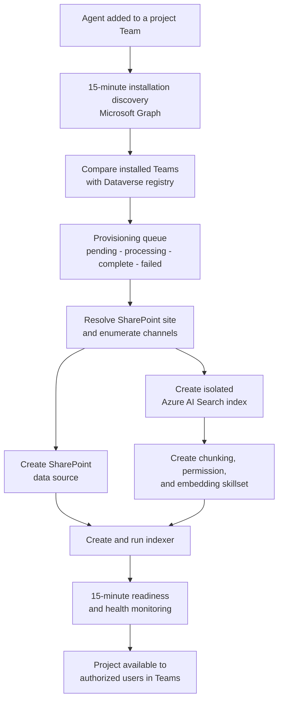
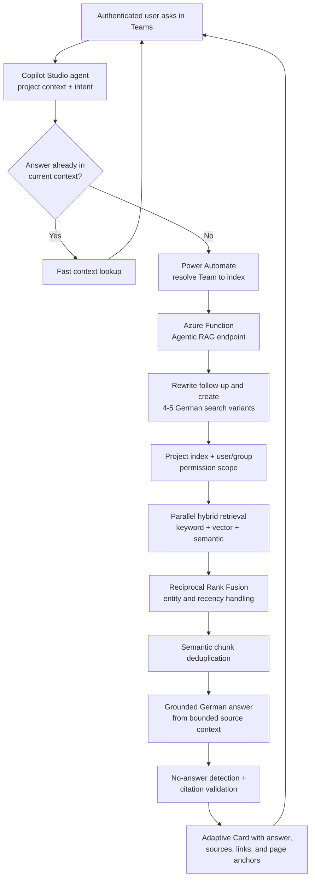

# Turning a Microsoft Team into a Secure, Searchable Project Memory

**An independently designed project-knowledge platform spanning Microsoft Teams, SharePoint, Copilot Studio, Power Automate, Azure AI Search, Microsoft Graph, Azure Functions, and a custom Agentic RAG pipeline.**

- **Role:** Sole architecture and hands-on implementation
- **System shape:** Teams-native agent, automated project onboarding, isolated
  search infrastructure, permission-aware ingestion, and two-speed retrieval
- **Environment:** Microsoft Copilot Studio, Power Automate, Dataverse,
  Microsoft Graph, SharePoint, Azure AI Search, Azure Functions, Prompt Flow,
  Python, Azure OpenAI, Adaptive Cards

> **Client, tenant, project, and document details have been anonymized.**

## Executive summary

The customer organized construction projects in Microsoft Teams. A project
could contain hundreds of participants, multiple channels, and large volumes of
SharePoint documents: specifications, protocols, spreadsheets, presentations,
plans, commercial information, and technical records. The documents were
available, but finding the right fact quickly was difficult. Access was also
not uniform. A project manager, an office employee, and a person working on a
different project must not automatically see the same material.

I independently designed and implemented a system in which an AI agent can be
added to a project Team like a digital project colleague. That installation
starts an automated onboarding process. The platform discovers the Team and its
SharePoint site, registers its channels, creates isolated Azure AI Search
resources, begins ingesting the project documents, extracts their permissions,
and makes the correct search index available to the agent. Users can then ask
questions in German, locate documents, request the latest material, continue a
conversation, or switch between projects to which they belong.

The visible interface is a Copilot Studio agent in Teams. The actual solution
is a distributed system. During development, it grew to **17 versioned Power
Automate cloud flows** coordinating installation discovery,
provisioning, channel handling, permission synchronization, search, status
monitoring, and responses. The retrieval layer evolved into a custom Agentic
Prompt Flow capable of expanding one question into four or five complementary
searches, running hybrid retrieval in parallel, fusing and deduplicating the
results, detecting unsupported answers, and returning up to ten citations that
link directly to the source document and, for PDFs, the relevant page.

The hard part was not adding a chat window to SharePoint. It was making a set of
Microsoft products behave like one secure, self-provisioning project-knowledge
platform, even where the products did not provide the required integration out
of the box.

## The real problem was the lifecycle around the answer

A simple proof of concept can connect one fixed folder to one fixed search
index and answer a prepared question. That does not solve the customer problem.
The real system had to answer a longer list of questions before it could answer
the user's question at all:

1. Which Team represents the current project?
2. Has the agent just been installed in a new Team?
3. Which SharePoint site and channels belong to it?
4. Does the search infrastructure for this project already exist?
5. Is indexing ready, running, delayed, or broken?
6. Which projects may the current user select?
7. Which documents inside the selected project may that user read?
8. Is the current message a short follow-up or a new research task?
9. Can the system prove its answer with sources the user can open?

No single Microsoft service answered all nine. Copilot Studio was useful as the
Teams-native conversation surface, but its standard retrieval path did not
provide the control needed for broad, precise, cited research over project
documents. SharePoint owned the files and access rules. Azure AI Search owned
retrieval. Microsoft Graph exposed the missing Team, channel, membership, site,
and file-permission information. Power Automate had to coordinate platform
events and state. Python and Prompt Flow had to implement the retrieval logic
that the low-code layers could not express reliably.

The architecture therefore separates two systems that happen to meet in the
same agent:

- a **control plane** that discovers projects and builds the required search
  infrastructure; and
- a **query plane** that turns an authenticated user's question into a
  permission-filtered, source-cited answer.

## The control plane: installing the agent provisions a project

The most useful product decision was to treat an agent installation as an
infrastructure event. Adding the agent to a Team should not produce a ticket for
someone to configure an index manually. It should cause the project to become
searchable.

Copilot Studio did not expose a dependable installation event for the complete
workflow, so the system discovers new installations through Microsoft Graph on
a 15-minute cycle. It pages through the customer's Teams, checks where the
agent is installed, compares those Teams with the registered projects in
Dataverse, and places unknown Teams into a provisioning queue.

The queue is important. Provisioning is not one API call; it is a multi-step
operation across services with different failure behavior. Queue state makes
the process observable and recoverable instead of leaving a half-created
project hidden inside a monolithic flow.

One orchestration flow owns the project lifecycle and delegates bounded tasks
to smaller flows: create the index, create the data source, create the
skillset, process each channel, create the indexer, look up status, and report
the final state. Private channels are handled separately because their files
and permissions do not behave like the default Team document library.

This decomposition is why the solution grew to 17 cloud-flow definitions
during development. That scale reveals the lifecycle logic hidden behind the
apparently simple instruction “add the agent to this project.” Later iterations
consolidated duplicate and superseded orchestration flows without changing the
underlying responsibilities.

## Project isolation is an architectural boundary, not a prompt instruction

I did not put every construction project into one undifferentiated vector
database and ask the model to remember a project name. Each registered Team is
routed to its own Azure AI Search index. Dataverse stores the relationship
between Team, channels, SharePoint location, index name, provisioning state,
and operational status.

When a conversation begins, the agent calls a membership flow that retrieves
the registered Teams and verifies the current user against the membership of
each Team through Microsoft Graph. The agent automatically restores the last
valid project or selects an available project; the user can explicitly switch
projects when required. The chosen Team ID is then resolved to its search index
before the query reaches the RAG engine.

This creates a first, coarse security boundary: a user cannot simply type the
name of another project and route a query into its index. Project selection is
derived from identity and actual Team membership.

The second boundary exists inside the index. During ingestion, a custom skill
resolves the SharePoint file and retrieves its user and group permissions
through Microsoft Graph. The allowed principals are stored as filterable
metadata alongside every projected document chunk. At query time, the user's
identity and group context become an OData filter applied by Azure AI Search
before any chunk is passed to the language model.

The resulting security model is deliberately layered:

- **membership filtering** determines which projects the user may select;
- **per-project indexes** prevent accidental cross-project retrieval; and
- **document-level principal filtering** preserves more granular SharePoint
  access rules within the selected project.

The model is the final consumer of authorized search results, not the component
responsible for deciding authorization.

## The ingestion pipeline keeps documents useful, not merely searchable

For every project, the provisioning flows create the search schema and the
complete ingestion chain. The current schema stores content, vectors, document
name, searchable filename, document type, SharePoint path, page and chunk
positions, upload date, file size, and allowed principals.

The SharePoint indexer accepts PDF, Word, Excel, and PowerPoint documents. A
text-splitting skill breaks extracted content into overlapping chunks, a custom
merge skill preserves useful chunk position information, an Azure OpenAI skill
generates embeddings, and index projections write the enriched chunks into the
project index. The indexer runs immediately when it is created and, in the
production configuration, synchronizes the project documents every 15 minutes.
Installation discovery and index readiness are also checked every 15 minutes,
but remain independent processes.

Separating these clocks matters. A search request should not need to know how a
Team was discovered, and the agent should not need to be redeployed when the
customer changes the desired indexing interval. Discovery, ingestion, health
monitoring, and query execution can evolve independently.

The system also treats filenames as information. Construction users often know
an exact project code, document number, standard, company, or location. Those
short entities can be damaged by a purely semantic embedding search. The index
therefore contains both regular document metadata and a dedicated searchable
filename field, allowing an exact entity-oriented path to complement semantic
retrieval.

## The query plane: a fast follow-up path and a real Deep Search

Not every message deserves the full retrieval pipeline. If a user asks a short
follow-up whose answer is already present in the current conversation context,
the agent can use a lightweight knowledge lookup. If the question introduces a
new fact, asks for documents, requests more detail, refers to a project entity,
or otherwise requires fresh evidence, the agent invokes the custom Deep Search.

This distinction keeps simple conversational continuity fast without allowing
the agent to answer factual project questions from its own model knowledge. The
agent instructions are explicit: document and project claims must go through a
knowledge path. When in doubt, search rather than guess.

The Power Automate query orchestration does more than relay HTTP. It validates
that a Team context exists, resolves the correct index, calls the Agentic RAG
endpoint with conversation history and security context, distinguishes success,
no-result, lookup failure, and system failure, updates conversation state, and
formats the returned citations for Copilot Studio.

## RAG v2: broaden retrieval, then aggressively control what survives

The first custom RAG proved that the Microsoft-native path could be replaced.
The later Agentic RAG version focused on the cases that make enterprise search
hard: vague follow-ups, German compound words, project codes, near-duplicate
chunks, “latest document” questions, exclusions, and requests whose answer does
not exist.

### 1. Let the agent classify once

Copilot Studio already has the conversational context to decide whether a
message is a new search, a follow-up, or a request for deeper detail. The
Agentic RAG endpoint accepts that classification instead of paying for a second
general classification step in Python. For a new search it can skip rewriting.
For a vague follow-up it first rewrites the message into a standalone question
using the previous query and answer summary.

That order is deliberate. An earlier attempt expanded a vague phrase such as
“what else?” in parallel with rewriting it. The expansion therefore searched
for a context-free sentence and returned unrelated documents. The corrected
pipeline rewrites first and expands the rewritten query second. It accepts a
small sequential cost where correctness requires dependency.

### 2. Search from several semantic angles

The query-expansion step produces four variants for a general question and a
fifth entity anchor when it detects a project name, company, location, person,
standard, or identifier. The variants include the original formulation, a
broader version, a specialized version, a different practical angle, and, when
appropriate, the entity by itself. The same step recognizes enumeration,
cost-related, negation, abbreviation, and recency intent.

Each normal branch can retrieve up to 20 chunks through a hybrid Azure AI
Search query combining lexical search, vector similarity, and semantic ranking.
Embeddings are generated in a batch and the retrieval branches run in parallel.
For short identifiers, the pipeline can disable vector search and emphasize
filename and keyword matching instead of allowing a poor embedding for a short
code to add noise. A recency branch can inspect 50 date-sorted chunks before
document-level deduplication.

### 3. Fuse evidence instead of trusting one ranking

Reciprocal Rank Fusion combines the independent result lists. A chunk that
appears near the top for several useful formulations receives more weight than
a chunk that happens to score well for only one phrasing. Entity anchors can
use a filename-focused scoring profile, excluded document types become hard
search filters, and recency results are re-sorted by upload date.

The pipeline then retains a bounded result set and performs semantic
deduplication. It embeds the candidate chunks in one batch, calculates their
similarity matrix, clusters near-duplicates, and keeps the strongest chunk from
each cluster. This prevents repeated passages or multiple almost-identical
pages from consuming the model context.

An older architecture contained a second “rerank” node that issued another
Azure AI Search request. It looked like additional intelligence in the visual
flow but was actually repeated retrieval. I removed that redundant call and
made the fusion step emit the downstream ranking contract directly.

### 4. Generate only from bounded evidence

The answer model sees no more sources than the citation layer can represent.
The Agentic RAG keeps up to 20 fused candidates for downstream confidence
analysis, but caps the generation context at ten. The German system prompt
requires inline citations, forbids unsupported external knowledge, and uses a
different instruction for follow-ups so the answer adds information instead of
repeating the previous response.

After generation, a multi-signal no-answer stage checks retrieval availability,
score strength, answer content, and entity matches. It can return a real
no-result state instead of forcing a fluent answer from weak evidence. The
citation stage parses the model's citation markers, validates their bounds,
maps them back to the source chunks, removes duplicates, attaches representative
quotes, and builds SharePoint links. PDF citations include a page anchor when a
valid page number exists.

The final formatter renumbers citation gaps, limits response size, preserves
German text, stores a bounded query history, and returns a structured contract
to Power Automate. Copilot Studio renders the answer and sources as an Adaptive
Card inside Teams.

## Engineering the seams between low-code and code

This project required moving comfortably between very different engineering
surfaces. A Copilot topic is declarative conversation YAML with Power Fx
expressions. A cloud flow is a JSON-defined distributed workflow with connector
contracts and run-after conditions. Azure AI Search needs schemas, data
sources, skillsets, indexers, projections, scoring profiles, and OData filters.
Microsoft Graph is the missing integration layer for Teams, SharePoint,
memberships, channels, sites, installations, and permissions. Prompt Flow is a
DAG, but its most important nodes are still Python services with typed inputs,
tests, error handling, caching decisions, and operational limits.

I treated the low-code parts as software rather than as diagrams that happen to
run. Responsibilities were split into smaller flows. Provisioning state lived
in Dataverse. Failure paths were explicit. Agent topics logged routing,
selection, success, and no-result events. Query responses had stable contracts.
Search resources were named and selected dynamically rather than copied by
hand for each project.

That approach was especially important because several required operations had
no convenient first-party button. The implementation had to compose available
APIs into behavior the platform did not natively offer: detect installation,
discover the associated site, provision a project-specific search stack,
extract access principals, route an authenticated question into the correct
index, and return a cited answer to the same Teams conversation.

## Outcome

The result turns a project Team from a passive document container into a usable
project memory. Adding the agent initiates onboarding. Authorized users receive
the projects they can actually access. Each question is routed into the correct
project index. Retrieval is constrained before generation. Answers can point
back to the exact SharePoint document instead of asking the user to trust the
model.

For the customer, the visible interaction remains simple: open Teams and ask
the project agent. Behind it, the platform coordinates installation discovery,
provisioning, indexing, permissions, project switching, conversation state,
retrieval, grounded generation, citations, and failure handling.

For me, this project is a good example of the work I want to continue doing. It
started with an ambiguous customer problem, crossed cloud architecture,
software engineering, security, AI retrieval, and stakeholder constraints, and
required hands-on implementation all the way down. There was no single product
or tutorial that supplied the solution. I had to understand where each
platform ended, design the missing system between them, and make the complete
experience work.

## Engineering principles that transfer beyond this project

1. **Treat onboarding as a product capability.** A multi-project system is not
   scalable if every new project requires manual infrastructure work.
2. **Enforce access before the model sees content.** Authorization belongs in
   membership, routing, and retrieval layers, not in a natural-language prompt.
3. **Separate the control plane from the query plane.** Provisioning and
   ingestion failures should not be hidden inside a search request.
4. **Use models where interpretation helps, and deterministic systems where
   boundaries matter.** LLMs expand and formulate; IDs, filters, queues,
   schemas, and response contracts control the system.
5. **Broaden recall before narrowing context.** Multi-query retrieval improves
   the chance of finding the right evidence; fusion, filtering, and
   deduplication decide what is safe and useful to retain.
6. **Make no-answer a first-class outcome.** A trustworthy enterprise agent
   must be able to say that the documents do not support an answer.
7. **Treat constrained platforms as engineering environments.** Copilot Studio
   and Power Automate still require architecture, modularity, observability,
   source control, and disciplined failure handling.

That is the core of the case study: not “I connected an LLM to SharePoint,” but
“I built the missing platform that turns many permissioned construction
projects into secure, conversational knowledge systems.”
