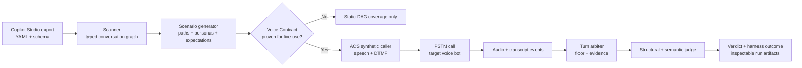
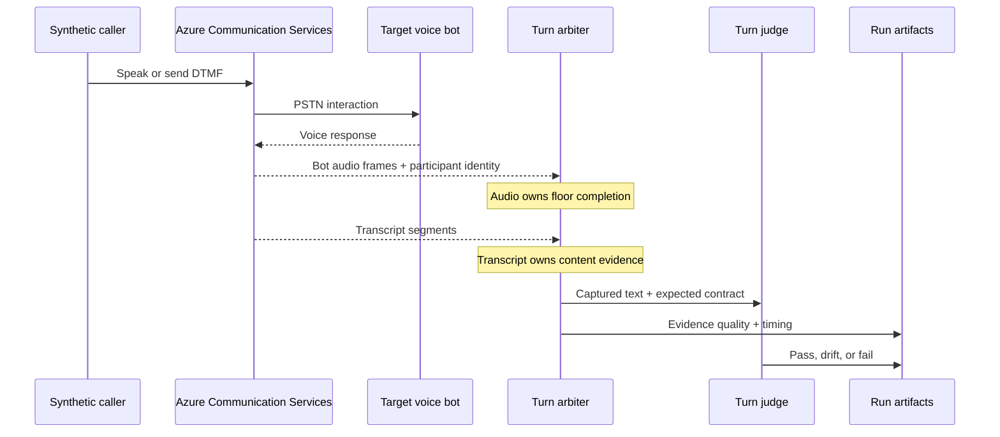

# An Agent That Phones a Voice Bot and Grades Every Answer

**A real-call regression harness for an enterprise voice agent, built on Azure Communication Services.**

- **Role:** Architecture and hands-on implementation
- **Initial usable delivery:** Approximately three and a half weeks
- **Environment:** Microsoft Copilot Studio, Azure Communication Services,
  Python, FastAPI, Event Grid, WebSockets, Blob Storage, LLM-based generation
  and evaluation

> **Client details and call content have been anonymized.**

## Executive summary

The client team already maintained a structured Excel test catalog. After
changes to a voice bot, testers spent several hours executing 15 to 20 cases by
phone and returned documented steps, expectations, and observations. The
process was disciplined, but the resulting spreadsheet was not an executable
replay for the development team. It could describe a failed conversation
without preserving the exact spoken interaction, channel timing, captured
turn evidence, or runtime state needed to reproduce its technical cause.

I designed and implemented a framework that treats the voice bot like software:
it reads an exported Copilot Studio solution, reconstructs the conversation
logic as a directed graph, derives test paths, generates multi-turn caller
scenarios, places real phone calls through Azure Communication Services, and
grades every bot turn. The first usable version was built in approximately
three and a half weeks and became part of the customer project. The approach
later attracted interest from multiple Microsoft contacts for potential use in
other customer environments.

The calls and the LLM judge make the demo memorable. The important engineering
decision is less visible: the framework keeps a bot failure separate from a
failure of its own evidence collection. If the call was audible but no usable
transcript arrived, it reports the run as **inconclusive**. It never converts
“I could not measure it” into “I measured a failure.”

## The testing gap

Voice agents have at least three distinct validation surfaces. A platform test
pane can catch authoring issues. A text channel can exercise topic routing
cheaply. Neither proves what happens on the phone line, where speech synthesis,
telephony, speech recognition, DTMF keypad tones, timing, and barge-in behavior
become part of the product.

A value can be valid as text and still fail in a real call. During development,
an identifier passed static validation in several written forms. Only one
spoken rendering survived text-to-speech, the phone channel, speech
recognition, and the bot's own parser. The string was valid; the voice contract
was not proven.

That distinction changed the task. The question was no longer only “Can I
generate a valid test case?” It became “Did this interaction really happen on
the target channel, and what evidence allows the system to judge it?”

## The system: scan, generate, call, judge

The framework is an agent that tests another agent. One command coordinates the
pipeline, and each phase can be resumed independently.

### 1. Scan the bot into an observable graph

The scanner reads the exported Copilot Studio solution and parses the YAML
definition into a typed graph of topics, actions, questions, conditions, and
cross-topic transitions. The graph is the structural model of what the bot can
do. It makes paths explicit that are almost impossible to cover consistently by
manual dialing.

The parser was not built by waiting for perfect platform documentation. Before
the required authoring surface was available in a usable public form, I had
already inspected the Copilot Studio Language Server used by the VS Code
extension and extracted **51 action kinds and 28 trigger kinds**. The later
official schema became an additional validation source rather than the starting
point for the implementation.

On one imported bot, the scanner enumerated **267 distinct dialog paths**. That
made the gap immediately visible: a manually executed subset could not provide
a repeatable regression strategy for the full conversation graph.

### 2. Generate conversations without inventing proof

The generator walks bounded paths and produces multi-turn scenarios with speech,
DTMF, choices, expected milestones, and negative cases such as invalid or
under-length input. LLMs help create natural caller behavior, but deterministic
graph constraints and scenario validation define what the scenario must cover.

Generated input is not automatically considered safe for a real call. The
framework uses a bot-scoped **Voice Contract** for values whose live behavior
depends on the target system: startup codes, identifiers, consent responses, or
fixture-bound customer data. A generated scenario can remain useful for static
DAG coverage while being explicitly barred from live proof until its spoken
rendering has been supplied or accepted on the real channel.

Identifier readiness is surfaced as data rather than hidden in a prompt:

- `catalog_backed`: the exact rendering is backed by an approved catalog or
  live evidence and may be used for a strict voice proof;
- `suspicious_generated_identifier_speech`: plausible, but not proven live;
- `unknown_identifier`: no approved rendering exists.

This preserves generation speed without allowing fabricated credentials or
unproven speech forms to masquerade as evidence.

### 3. Place real calls on the real channel

The live runner uses **Azure Communication Services Call Automation** to place
PSTN calls. A long-lived asynchronous session owns the infrastructure for a
batch: it opens a public callback tunnel, starts an in-process FastAPI server,
creates the required Event Grid subscription, binds the callback dispatcher,
runs the scenarios, and removes temporary infrastructure during teardown.

The synthetic caller speaks through text-to-speech and can send DTMF tones. ACS
media streaming and real-time transcription arrive over WebSockets. Optional
call recording is finalized into Blob Storage and linked to the run artifacts
when recording is enabled. A live cockpit can display the scenario queue,
waveform, transcripts, timing, keypad input, and verdicts while the suite runs.

Real calls have real cost and operational risk, so the scheduler enforces both
a voice-minute budget and a hard parallel-call limit. Static graph scenarios
are never silently executed as live proof; the runner loads only scenarios with
an explicit live-proof or live-negative contract.

### 4. Grade every turn, then grade the evidence

Each bot turn receives a structural and semantic evaluation. The structural
check verifies whether the observed topic belongs to the expected set. The
semantic judge evaluates the captured utterance against the scenario's
`must_satisfy` rules and drift signals. The result rolls up into:

- **Pass:** the expected behavior was observed;
- **Drift:** the conversation remained structurally plausible but the answer
  moved outside the expected behavior;
- **Fail:** the required behavior could not be established.

More specific states such as `wrong_topic` and expected voice
rejection preserve diagnostic value. The model version, confidence, reasons,
flags, latency, expected topics, and actual captured text remain attached to
the verdict.

The verdict is only one half of the result. The run also has a **harness
outcome**. A judge timeout, transcript gap, cancellation, or disconnect without
text proof produces `inconclusive` evidence instead of an accusation against
the bot.

## The hard boundary: when is the bot done talking?

The caller may speak only after the bot has finished. Advancing too early means
the caller talks over the bot. Advancing too late puts every turn behind an
arbitrary timer.

An early implementation relied on a long transcript-settle window. That was
slow and conceptually wrong. Transcription can lag, split one response into
multiple phrases, or disappear even while the bot is audibly speaking. The fix
was to separate two signals that answer different questions:

- **Audio owns turn completion.** Media frames show when the bot acquires and
  releases the speaking floor.
- **Transcription owns content evidence.** Text is what the semantic judge can
  evaluate, but it does not decide when the turn ends.

The current turn arbiter tracks bot and caller participants separately, records
audio start and end markers, applies a continuation guard, and gives the
transcript a bounded grace period. Only bot audio can close the bot's floor.
When the platform's `silent` flag proved unreliable on the observed PSTN path,
the media parser fell back to energy measured from the raw PCM16 samples.

In one live smoke call, the old 15-second transcript settle was
replaced by a hybrid audio/transcript closure with **3,013 ms of harness wait**.
That run still found a genuine behavioral drift: the timing mechanism worked,
captured the answer, and allowed the judge to identify that the bot asked for a
code again. Faster closure did not manufacture a pass.

## Two failure planes that must remain separate

A live regression can fail in two fundamentally different ways.

First, the bot answers incorrectly and the harness captures enough evidence to
prove it. That is a business verdict, and the bot or scenario expectation must
be investigated.

Second, the call runs but the instrumentation cannot prove what happened. The
transcription WebSocket may open without producing a usable bot segment. A
recording may exist without machine-readable text. The semantic judge may time
out. That is a harness failure, not a bot verdict.

Every run therefore records both dimensions:

| Business plane | Evidence plane | Interpretation |
|---|---|---|
| Pass / drift / fail | `transcript_ready` | The behavior verdict is supported by text evidence. |
| Not asserted | `inconclusive_recording_only` | Audio exists for manual diagnosis, but automated text proof is missing. |
| Not asserted | `inconclusive_no_transcript` | The harness cannot prove the bot response. |
| Not asserted | `judge_timeout` or cancellation | The measurement process did not complete. |

This split prevents a red dashboard full of defects that actually mean “the
test instrument lost the signal.”

## Recover real evidence, never invent it

One live flow exposed the boundary at the final turn. The bot audibly
completed identity verification, said goodbye, and disconnected. Audio was
present, but the last ACS transcription segment did not arrive before the
disconnect. The correct initial result was `disconnect_without_text_proof`, not
a pass.

The fix did not weaken that rule. When bot audio exists at disconnect, the
timeline first checks for a pending intermediate transcript and can then invoke
a PCM-based recovery path. If recovered text adds genuine evidence, the turn
closes as `transcript_fallback`. If recovery produces nothing, the result stays
inconclusive.

After this fix, the run completed **10 scheduled turns with 10
transcript-backed pass verdicts**, observed the final disconnect, finalized the
recording, and reported `harness_outcome=ok`. The paired regression tests
also pin the negative side: audio without recoverable text must remain a
disconnect without text proof.

## Outcome

The initial working system turned the client's structured manual test catalog
into a repeatable execution layer that identifies the exact conversation turn,
expected behavior, actual evidence, and reason for drift or failure. It did not
replace the test knowledge captured by the customer team. It made those
scenarios executable on the real phone channel and preserved artifacts that
developers could inspect and replay when diagnosing a result.

The enduring result is the decision system around the calls: explicit proof
levels, bounded live execution, evidence-aware verdicts, and a harness that can
say “I do not know.”

## Transferable engineering principles

1. **Separate “could not measure” from “measured a failure.”** Instrument
   health and product verdicts are orthogonal outcomes.
2. **Use different signals for completion and content.** When the system is
   done and what it produced are separate questions.
3. **Make proof level part of the data model.** Static validity, generated
   plausibility, and live acceptance must not collapse into one boolean.
4. **Recover evidence, never fabricate it.** Fallbacks may extract proof from
   captured raw signals; they may not infer success from absence.
5. **Put cost and risk into the control plane.** Real external actions need
   budgets, concurrency limits, teardown, and inspectable artifacts.

The memorable part is an AI that phones another AI. The reason the result is
usable is simpler: the harness knows the difference between a voice bot that
failed and a test that could not see, and it would rather return
**inconclusive** than return something false.
